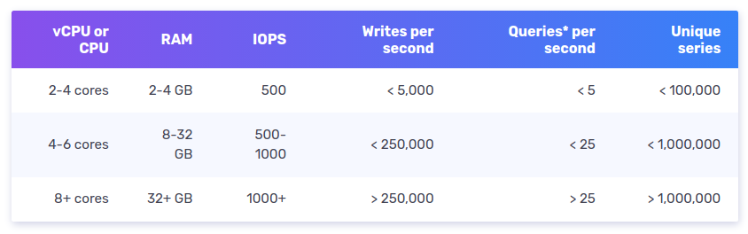
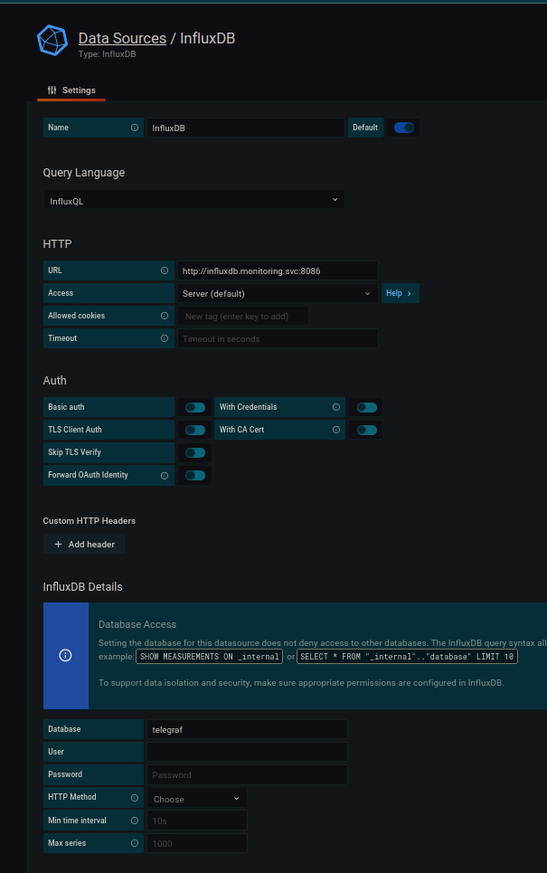
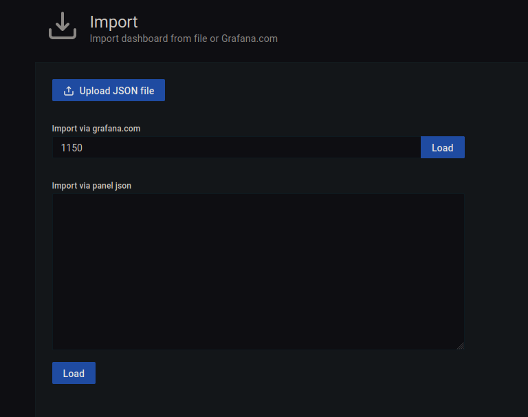
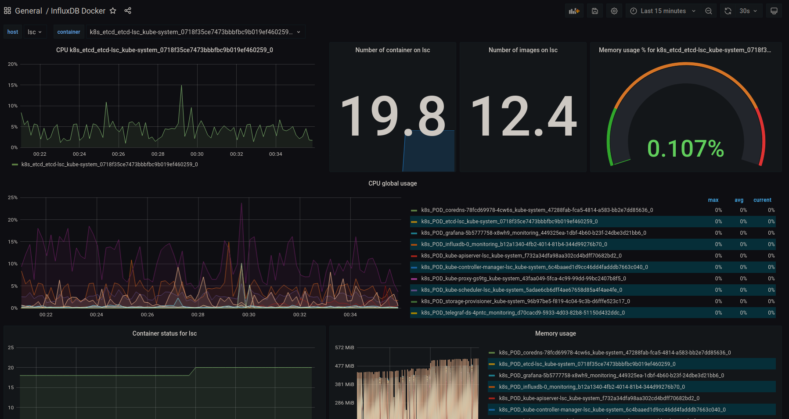
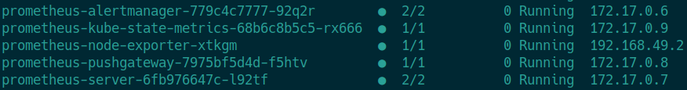
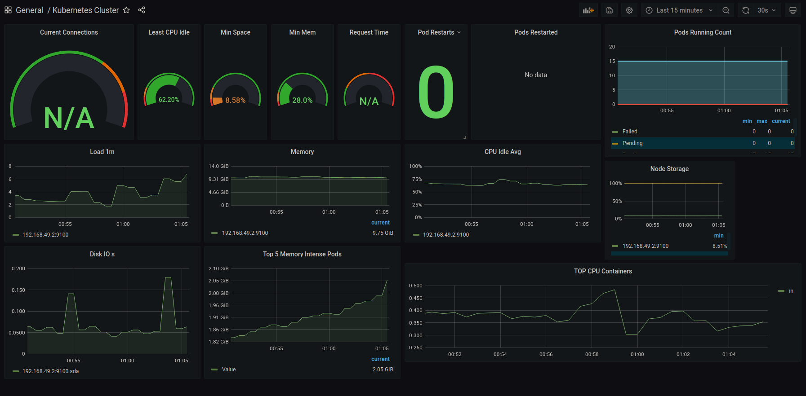
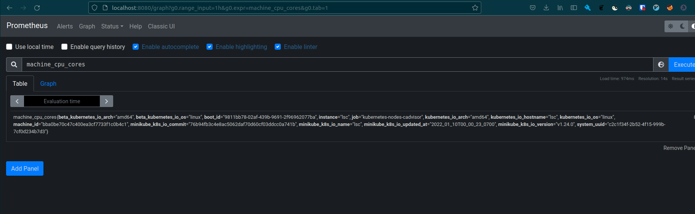
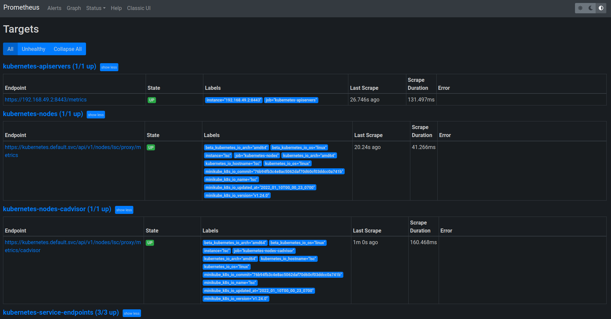
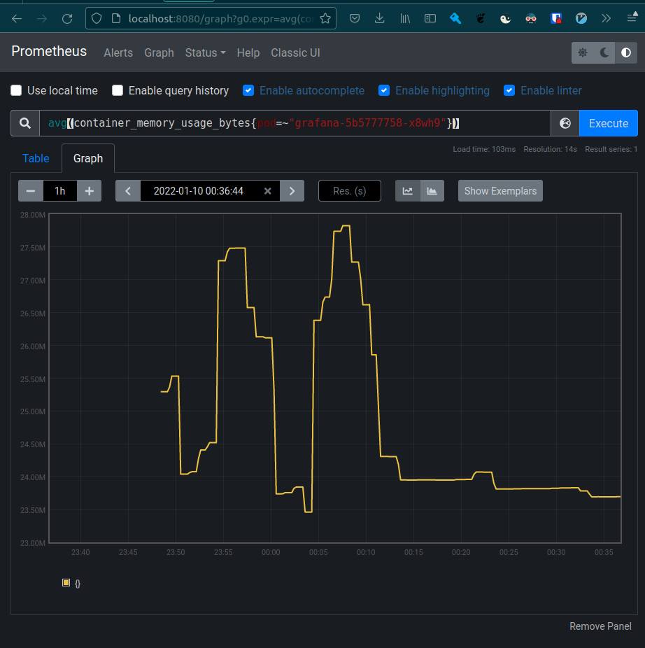
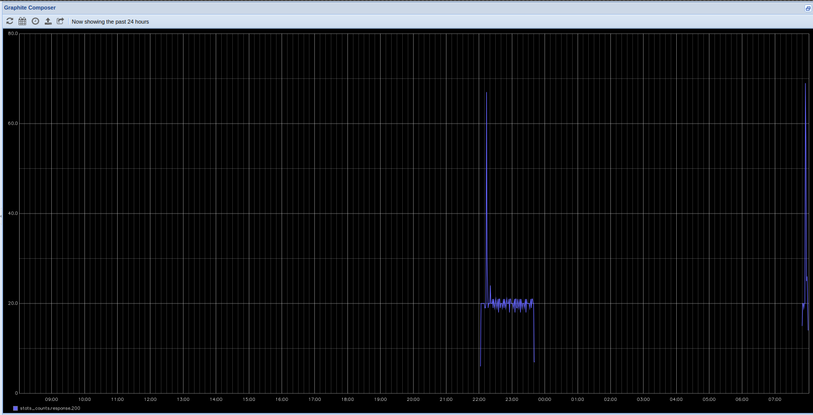

# lsc-k8s-scaling

Purpose of this repository is a comparison of three kubernetes metrics storages - **InfluxDb**, **Prometheus** and **Graphite**.

**Requirements**
- minikube - `>= 1.24.0`
- kubectl
- helm

It may be needed to allow access to ports by disabling firewall:
```console
$ sudo ufw allow PORT_NUMBER
```

## setup - k8s cluster

Only for demonstration purposes we use Kubernetes clusters locally with MiniKube.

```console
$ minikube version      
minikube version: v1.24.0
commit: 76b94fb3c4e8ac5062daf70d60cf03ddcc0a741b

$ minikube start -p lsc
(...)
$ kubectl cluster-info
Kubernetes master is running at https://192.168.49.2:8443
KubeDNS is running at https://192.168.49.2:8443/api/v1/namespaces/kube-system/services/kube-dns:dns/proxy

To further debug and diagnose cluster problems, use 'kubectl cluster-info dump'.

$ minikube -p lsc ssh
Last login: Sun Jan  9 19:20:59 2022 from 192.168.49.1
docker@lsc:~$ sudo chmod 666 /var/run/docker.sock
```

# Metrics

In general, metrics are numeric measurements recorded over time, so they could be understood as time series. Example pack of metrics for web application includes number of requests per time unit, response code statistics, average CPU usage, etc. In this project we measure metrics for Kubernetes pod with instance of each studied technology.

# Grafana

Grafana is an open-source software made by GrafanaLabs which allows its user to query and visualize given metrics. It is compatible and easy connectable with InfluxDB, Prometheus and Graphite what was the main reason of decision of using it for project results' presentation.

The most suitable method to use it with Kubernetes is to install it with helm:

```console
$ helm repo add grafana https://grafana.github.io/helm-charts
$ helm install grafana -n monitoring grafana/grafana
```

Fetch secret - admin password needed to login to the Grafana Dashboard from browser:

```console
$ kubectl get secret --namespace default grafana -o jsonpath="{.data.admin-password}" | base64 --decode ; echo
```

The method to view Grafana Dashboard is presented in the next section of this report.

# InfluxDb

InfluxDB is an open-source database designed for time series storage by InfluxLabs. Data is stored in tables or in trees and for every piece of it a _time column with a timestamp is present. This is an example of push architecture - data must be directly written into the database. It is similar to SQL databases but is additionally optimized to handle time series data. In addition, a query language InfluxQl similar to SQL has been designed.

## Line protocol

Data points are written with use of the line protocol. This text-based format consists of the following elements:
* Measurement - measurement name (required)
* Tag set - tag key-value pairs for particular point (optional)
* Field set - all field key-value pairs for the point (required)
* Timestamp - the Unix timestamp for the data point (optional)
* Whitespace - non-escaped whitespaces delimit elements of a data point, the former separates Measurement and Tag set from Field set while the latter separates Field set from Timestamp.

Example:
```
measurementName,tagKey=tagValue fieldKey="fieldValue" 1465839830100400200
```

## Costs and requirements

While InfluxDB for single node is fully open source, for a bigger performance an Enterprise version is needed. The documentation states that single node does not require redundancy but it is a dangerous case, due to failure of writes and queries when a server is unavailable. A demand for high-performance is defined as one of the following:
* more than 750,000 writes per second
* more than 100 moderate queries per second
* more than 10,000,000 series cardinality

From hardware side, it is recommended to use SSDs to store data. In addition other requirements are rather big:

<sub><sup>Screenshot taken from official website: https://docs.influxdata.com/influxdb/v1.8/guides/hardware_sizing/#influxdb-oss-guidelines</sup><sub>

## Installation on Kubernetes

```console
$ helm repo add influxdata https://helm.influxdata.com
$ helm upgrade -i influxdb influxdata/influxdb
```

## Port-forwarding for Grafana

```console
export POD_NAME=$(kubectl get pods --namespace default -l "app.kubernetes.io/name=grafana,app.kubernetes.io/instance=grafana" -o jsonpath="{.items[0].metadata.name}")

kubectl --namespace default port-forward $POD_NAME 3000
```

## Telegraf

Telegraf is used here to provide metrics source for InfluxDB.

Installation:
```console
$ KUBERNETES_HOST=$(minikube -p lsc ip)
$ helm upgrade --install -n monitoring telegraf-ds \
--set daemonset.config.outputs.influxdb.urls={http://influxdb.monitoring:8086} \
--set daemonset.config.inputs.kubernetes.url=http://${KUBERNETES_HOST}:10255 \
influxdata/telegraf-ds
```

Metrics are being pulled from docker socket - telegraf is running as `DaemonSet`

```console
kubectl describe cm -n monitoring telegraf-ds | grep -C 1 docker

[[inputs.docker]]
endpoint = "unix:///var/run/docker.sock"
```

## Verify if metrics are sunk into InfluxDb

From inside of InfluxDb container find if the **telegraf** database has been created:

```console
$ influx
Connected to http://localhost:8086 version 1.8.6
InfluxDB shell version: 1.8.6
> SHOW databases
name: databases
name
----
_internal
telegraf
```

Example queries on metrics data:

```sql
$ influx
Connected to http://localhost:8086 version 1.8.6
InfluxDB shell version: 1.8.6
> SELECT usage_percent, container_name FROM docker_container_mem LIMIT 15;
name: docker_container_mem
time                usage_percent         container_name
----                -------------         --------------
1641756151000000000 0.0014785347305364344 k8s_POD_kube-proxy-rbx9v_kube-system_68308d73-1217-4bfb-be6d-e52b6e30a601_0
1641756152000000000 0.0007575963082087515 k8s_POD_coredns-78fcd69978-2jspd_kube-system_f59622d8-7008-4447-99f8-2c6ba56d0cb9_0
1641756152000000000 0.0005376489929223398 k8s_POD_etcd-lsc_kube-system_0718f35ce7473bbbfbc9b019ef460259_0
1641756152000000000 0.0008186927846771992 k8s_POD_influxdb-0_default_8cee725a-c6c2-45e4-bd91-d94f868c729a_0
1641756152000000000 0.0005376489929223398 k8s_POD_kube-apiserver-lsc_kube-system_f732a34dfa98aa302cd4bdff70682bd2_0
1641756152000000000 0.0005376489929223398 k8s_POD_kube-controller-manager-lsc_kube-system_6c4baaed1d9cc46dd4fadddb7663c040_0
1641756152000000000 0.0005376489929223398 k8s_POD_kube-scheduler-lsc_kube-system_5adae6cb6dff4ae67658d85a4f4ae4fe_0
1641756152000000000 0.0005376489929223398 k8s_POD_storage-provisioner_kube-system_c9e1ca46-335a-4093-bd65-4d4aaec9e639_0
1641756152000000000 0.0008186927846771992 k8s_POD_telegraf-ds-w7xwh_default_4009ed2d-43a5-46d6-ae48-f221224b5b0d_0
1641756152000000000 7.0657169117647065    k8s_coredns_coredns-78fcd69978-2jspd_kube-system_f59622d8-7008-4447-99f8-2c6ba56d0cb9_0
1641756152000000000 0.10777418449034175   k8s_etcd_etcd-lsc_kube-system_0718f35ce7473bbbfbc9b019ef460259_0
1641756152000000000 0.04622559409602753   k8s_influxdb_influxdb-0_default_8cee725a-c6c2-45e4-bd91-d94f868c729a_0
1641756152000000000 0.6919053767098765    k8s_kube-apiserver_kube-apiserver-lsc_kube-system_f732a34dfa98aa302cd4bdff70682bd2_0
1641756152000000000 0.1438211056067259    k8s_kube-controller-manager_kube-controller-manager-lsc_kube-system_6c4baaed1d9cc46dd4fadddb7663c040_0
1641756152000000000 0.032992097292961764  k8s_kube-proxy_kube-proxy-rbx9v_kube-system_68308d73-1217-4bfb-be6d-e52b6e30a601_0
> SELECT mean(usage_percent) FROM docker_container_mem WHERE container_name='k8s_influxdb_influxdb-0_default_8cee725a-c6c2-45e4-bd91-d94f868c729a_0' LIMIT 15;

name: docker_container_mem
time mean
---- ----
0    0.4698723762118421

```

Or to verify if the node is healthy

```console
$ apk add curl jq
$ curl -XGET "localhost:8086/health" | jq .
  % Total    % Received % Xferd  Average Speed   Time    Time     Time  Current
                                 Dload  Upload   Total   Spent    Left  Speed
100   106  100   106    0     0  97069      0 --:--:-- --:--:-- --:--:--  103k
{
  "checks": [],
  "message": "ready for queries and writes",
  "name": "influxdb",
  "status": "pass",
  "version": "1.8.6"
}
```

## Setup Grafana dashboards 

```console
export POD_NAME=$(kubectl get pods --namespace monitoring -l "app.kubernetes.io/name=grafana,app.kubernetes.io/instance=grafana" -o jsonpath="{.items[0].metadata.name}")
kubectl --namespace monitoring port-forward $POD_NAME 300
```



Import example Docker [dashboard](https://grafana.com/grafana/dashboards/1150)






# Prometheus

Prometheus is an open-source set of systems designed for monitoring and alerting. It is able to store metrics as time series data. It also does not need agents to push data directly into database, it has an opportunity tu pull metrics from defined endopints.

It is designed for high reliability, even under failure conditions, so it suits problems when 100% accuracy is not a crucial issue.

All data is stored as time series, defined here as streams of timestamped values belonging to one of defined metrics identified by unique metric names.

Like InfluxDB, Prometheus has also its own query language named PrometheusQL.

## Chart installation

```console
helm repo add prometheus-community https://prometheus-community.github.io/helm-charts
helm install prometheus prometheus-community/prometheus -n monitoring
```




## Setup Graphana datasource the same way

```
server-url: http://prometheus-server.monitoring.svc:80
```
Grafana dashboard id - 7249 - [Kubernetes Cluster](https://grafana.com/grafana/dashboards/7249)



## Access Prometheus UI

```console
export POD_NAME=$(kubectl get pods --namespace monitoring -l "app=prometheus,component=server" -o jsonpath="{.items[0].metadata.name}")
kubectl --namespace monitoring port-forward $POD_NAME 8080:9000
```

### Example of scraped metrics


### List of scraped targets


### Interactive queries

Query:
`avg(container_memory_usage_bytes{pod=~"grafana-5b5777758-x8wh9"})`



# Graphite

Graphite is a project designed especially for monitoring metrics with push architecture - the tool is fed by external agents, e.g. collectd deamon. It is capable of storage of time series data and renedering graphs on user demand. It has its own dashboard for plotting pictures, however it is also easily pluggable into Grafana.

It was designed to be not too much demanding software, available also for cheaper architectures. It consists of 3 components:
* carbon - deamon listening for time-series data
* whisper - database library for storing time-series data
* graphite webapp - web application in Django responsible for graph rendering

The user's effort with usage of Graphite lays on collection of data and sending it to carbon.

Graphite is described as good horizontally scalling tool. It also is able to handle multiple data at a moment - I/O operations are usually small and even in the case of limited I/O operations of storage device it is able to keep data in cache until writing of all amount of it is possible.

## Installation:
```console
$ helm repo add kiwigrid https://kiwigrid.github.io/
$ helm install graphite -n monitoring kiwigrid/graphite
```

## Port-forward:
```console
$ export POD_NAME=$(kubectl get pods --namespace monitoring -l "app.kubernetes.io/name=graphite,app.kubernetes.io/instance=graphite" -o jsonpath="{.items[0].metadata.name}")
$ echo "Visit http://127.0.0.1:8080 to use your application"
$ kubectl -n monitoring port-forward $POD_NAME 8080:80
```

Used Graphite image automatically contains collectd deamon which is supporting metrics of the pod.

It is possible to view metrics directly from the Graphite dashboard, example with number of HTTP 200 responses is shown below:


# Influx DB vs Prometheus vs Graphite

// TODO: refer https://prometheus.io/docs/introduction/comparison/

# PromQL vs InfluxQl vs [Graphite]

// TODO

# References

* [Grafana](https://grafana.com/)
* [InfluxDB](https://www.influxdata.com/)
* [Telegraf](https://www.influxdata.com/integration/kubernetes-monitoring/)
* [Prometheus](https://prometheus.io/)
* [Graphite](https://graphiteapp.org/)